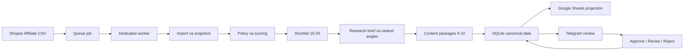

# Bao Cao Va Huong Dan Su Dung Affiliate Product Research

## 1. Muc dich

Affiliate Product Research la quy trinh nghien cuu san pham cong nghe cho
Shopee Affiliate. Tinh nang giup nguoi dung:

- nap danh sach san pham tu file CSV duoc xuat hop le;
- loc san pham theo nganh hang, gia, luong ban, danh gia va kha nang len hinh;
- chon 15-25 san pham tiem nang;
- tao 5-10 goi y noi dung gom hook, kich ban 30-90 giay, storyboard, prompt AI,
  voice-over, text overlay, bang chung va canh bao;
- dong bo ket qua sang Google Sheets;
- gui goi noi dung sang Telegram de duyet, sua hoac tu choi;
- khoi phuc job va projection sau loi tam thoi ma khong tao lai du lieu da hoan
  thanh.

Day la tinh nang nghien cuu va chuan bi nguyen lieu. Tinh nang khong tu mua san
pham, khong crawl trang Shopee/TikTok, khong tai video cua ben thu ba, khong
render video va khong tu dang bai.

## 2. Pham vi san pham

Nhom san pham duoc ho tro:

- ban phim, chuot, tai nghe;
- quat mini, den ban, den thong minh;
- hub, stand, cap va phu kien setup ban lam viec;
- phu kien gaming va workspace.

Chinh sach gia mac dinh:

- san pham thong thuong: 200.000-500.000 VND;
- ban phim: toi da 1.500.000 VND.

Doi tuong noi dung:

- dan van phong;
- game thu;
- nguoi thich setup goc lam viec.

## 3. Luong hoat dong



SQLite la nguon du lieu chinh. Google Sheets va Telegram chi la lop hien thi,
duyet va thao tac. Khong sua truc tiep database bang cong cu SQLite khi worker
dang chay.

Moi lan chay co:

- `job_id`: dinh danh mot queue job;
- `owner_user_id`: chu so huu du lieu;
- `idempotency_key`: khoa chong chay trung;
- `run_id`: duoc Hermes tao xac dinh tu owner va idempotency key.

Chay lai cung owner va cung idempotency key se tai su dung run cu. Hermes chi
retry projection con dang pending, khong import va tao package lai.

## 4. Chuan bi truoc khi dung

Can co:

1. Python virtual environment cua Hermes da cai dependency.
2. Shopee Affiliate Product Feed hoac file CSV do chinh nguoi dung xuat.
3. Quyen ghi vao `HERMES_DATA_DIR`.
4. Telegram bot neu muon duyet qua Telegram.
5. Google service account neu muon dong bo Google Sheets.

File CSV phai:

- nam trong `AFFILIATE_IMPORT_DIR`;
- la UTF-8 hoac UTF-8-SIG;
- khong lon hon 10 MB;
- toi da 5.000 dong;
- trong production nen co 100-200 candidate hop le.

Cot bat buoc:

| Du lieu | Ten cot chap nhan |
| --- | --- |
| Ma san pham | `item_id`, `product_id`, `id` |
| Ten san pham | `product_name`, `name`, `item_name` |
| Danh muc | `category`, `category_name` |
| Gia | `price`, `price_vnd`, `product_price` |
| Link san pham | `product_link`, `product_url`, `url`, `link` |

Cot tuy chon:

- luong ban: `sold`, `sold_count`, `sales`;
- danh gia: `rating`, `product_rating`;
- so review: `review_count`, `reviews`, `rating_count`;
- hoa hong: `commission`, `commission_rate`, `commission_percent`;
- shop: `shop_name`, `shop`, `seller_name`;
- anh: `image`, `image_url`, `images`;
- tin hieu hinh anh: `visual_signals`, `visual_signal`.

## 5. Cau hinh tren Windows

Vi du cau hinh tam thoi trong PowerShell:

```powershell
$env:AFFILIATE_IMPORT_DIR = "D:\HermesData\affiliate_imports"
$env:AFFILIATE_RESEARCH_SHORTLIST_LIMIT = "25"
$env:AFFILIATE_RESEARCH_PACKAGE_LIMIT = "10"

$env:GOOGLE_SHEETS_ENABLED = "0"
$env:GOOGLE_SHEETS_CREDENTIALS_FILE = ""
$env:GOOGLE_SHEETS_SPREADSHEET_ID = ""

$env:TELEGRAM_BOT_TOKEN = ""
$env:TELEGRAM_REVIEW_CHAT_ID = ""
$env:TELEGRAM_ALLOWED_USER_IDS = "42"
```

Gioi han hop le:

- `AFFILIATE_RESEARCH_SHORTLIST_LIMIT`: 15-25;
- `AFFILIATE_RESEARCH_PACKAGE_LIMIT`: 5-10;
- `GOOGLE_SHEETS_ENABLED`: `0/1`, `false/true`, `no/yes`, `off/on`.

Khi bat Google Sheets, bat buoc khai bao ca file credential va spreadsheet ID:

```powershell
$env:GOOGLE_SHEETS_ENABLED = "1"
$env:GOOGLE_SHEETS_CREDENTIALS_FILE = "D:\HermesSecrets\google-service-account.json"
$env:GOOGLE_SHEETS_SPREADSHEET_ID = "spreadsheet-id"
```

Khong dat token, credential hoac API key trong Git, Telegram message, CSV hay
Google Sheet. Chi chia se workbook dich cho email cua service account.

## 6. Tao mot job nghien cuu

Dat file, vi du:

```text
D:\HermesData\affiliate_imports\products-2026-08-01.csv
```

Tao job tu thu muc project:

```powershell
@'
from hermes.db import Database
from hermes.jobs import JobRepository

job = JobRepository(Database()).enqueue(
    "affiliate-2026-08-01",
    "42",
    "affiliate_product_research",
    {
        "csv_path": r"D:\HermesData\affiliate_imports\products-2026-08-01.csv",
        "idempotency_key": "daily-2026-08-01",
        "package_limit": 10,
        "reference_urls": [],
        "web_references": [
            {
                "external_product_id": "SKU-123",
                "url": "https://manufacturer.example.com/specs",
                "source_kind": "manufacturer"
            }
        ],
    },
    max_attempts=3,
)
print(job["id"], job["state"])
'@ | .\.venv\Scripts\python.exe -
```

Quy tac dat khoa:

- `job_id` phai duy nhat cho moi queue job;
- `idempotency_key` nen theo ngay hoac batch, vi du `daily-2026-08-01`;
- neu co y dinh tao mot run moi, phai doi idempotency key;
- `owner_user_id` phai nam trong danh sach Telegram duoc phep neu dung Telegram.

`reference_urls` chi dung cho link TikTok public duoc phep. Hermes chi lay
metadata oEmbed de nghien cuu pattern, khong tai video/anh/am thanh.

## 7. Chay worker

Chay lien tuc:

```powershell
.\.venv\Scripts\python.exe scripts\affiliate_research_worker.py
```

Chi xu ly toi da mot job de kiem tra:

```powershell
.\.venv\Scripts\python.exe scripts\affiliate_research_worker.py --once
```

Doi chu ky polling:

```powershell
.\.venv\Scripts\python.exe scripts\affiliate_research_worker.py --poll-seconds 5
```

Worker nay chi claim `affiliate_product_research`. Worker legacy khong claim
loai job nay. Khi worker khoi dong lai, job bi gian doan o trang thai `running`
se duoc recover ve queue hoac cancel theo trang thai da luu.

## 8. Doc ket qua Google Sheets

Hermes quan ly bay tab:

| Tab | Muc dich |
| --- | --- |
| `Products` | Candidate va snapshot trong run |
| `Shortlist` | San pham dat policy, score va rank |
| `Ideas` | Audience, angle, rationale va lua chon |
| `Scripts` | Kich ban, storyboard, prompt AI va evidence |
| `Approval Queue` | Package dang cho duyet |
| `Runs & Errors` | Trang thai run, counter va loi projection |
| `Web Evidence` | Metadata va nguon tai lieu web cong khai (V6) |

Cot canonical va `stable_id` do Hermes quan ly. Nguoi dung duoc:

- sua `review_notes`, `operator_notes`;
- them cot co tien to `custom_`.

Khong doi `stable_id`, score, rank, package status hoac cac cot generated.
Hermes giu cac cot editable noi tren qua lan dong bo tiep theo.

## 9. Duyet tren Telegram

Moi package pending co:

- anh san pham neu co;
- ten san pham, score va ly do;
- audience, hook, tom tat kich ban/storyboard;
- canh bao va package ID;
- nut `Approve`, `Revise`, `Reject`.

Thao tac:

- `Approve`: chuyen package sang `approved`;
- `Reject`: chuyen package sang `rejected`;
- `Revise`: huong dan gui feedback, chua doi state ngay;
- sua noi dung:

```text
/affiliate_revise <package_id> <feedback>
```

Vi du:

```text
/affiliate_revise a1b2c3d4e5f6 Viet hook ngan hon, nhan vao setup ban lam viec
```

Hermes generate va validate revision moi truoc, sau do moi chuyen parent sang
`revision_requested`. Neu model/validation loi, package cu giu nguyen state.
Callback lap lai va revision retry duoc xu ly idempotent.

## 10. Theo doi va quan ly job

Xem 30 job gan nhat cua owner:

```powershell
@'
from hermes.jobs import JobRepository

for job in JobRepository().list_jobs("42", limit=30):
    print(job["id"], job["job_type"], job["state"], job["stage"], job["error"])
'@ | .\.venv\Scripts\python.exe -
```

Trang thai chinh:

| State | Y nghia |
| --- | --- |
| `queued` | Dang cho dedicated worker |
| `running` | Dang import, scoring, packaging hoac projection |
| `completed` | Canonical run va tat ca projection da hoan thanh |
| `failed` | Het retry hoac gap loi can nguoi dung sua |
| `cancelled` | Job da duoc huy |

Retry job failed:

```powershell
@'
from hermes.jobs import JobRepository

job = JobRepository().retry("affiliate-2026-08-01", "42")
print(job["state"] if job else "Khong retry duoc")
'@ | .\.venv\Scripts\python.exe -
```

Huy job:

```powershell
@'
from hermes.jobs import JobRepository

job = JobRepository().cancel("affiliate-2026-08-01", "42")
print(job["state"] if job else "Khong huy duoc")
'@ | .\.venv\Scripts\python.exe -
```

Job running se nhan `cancel_requested` va worker acknowledge tai checkpoint an
toan. Job terminal khong the huy.

## 11. Retry, outbox va khoi phuc

Hermes hoan thanh canonical SQLite data truoc khi goi Google/Telegram.
Projection outbox va checkpoint duoc luu ben vung:

- loi Google/Telegram tam thoi: job duoc requeue neu con attempt;
- retry chi gui lai projection/package chua hoan thanh;
- package Telegram da checkpoint khong bi gui lai;
- package va revision co ID xac dinh, tranh tao duplicate khi process restart;
- migration V5 nang cap database cu va chuan hoa research brief legacy.

Telegram khong cung cap idempotency key. Van co mot cua so rat nho co the lap
message neu process chet sau khi Telegram da nhan message nhung truoc khi
SQLite luu message ID. Sau khi checkpoint duoc commit, cac retry tiep theo se
khong gui lai package do.

## 12. Xu ly su co

### Job khong duoc worker nhan

Kiem tra:

1. Worker affiliate co dang chay khong.
2. `job_type` co dung `affiliate_product_research` khong.
3. Job co state `queued` va chua bi cancel khong.
4. `available_at` co nam trong tuong lai khong.

### CSV bi tu choi

Kiem tra:

- path co nam trong `AFFILIATE_IMPORT_DIR`;
- file co dung `.csv`, UTF-8 va nho hon 10 MB;
- du cot bat buoc;
- gia, rating, sold count, review count va commission dung dinh dang/domain;
- so candidate production nam trong khoang 100-200.

### Google Sheets khong dong bo

Kiem tra:

- `GOOGLE_SHEETS_ENABLED=1`;
- credential file ton tai va service account co quyen workbook;
- spreadsheet ID dung;
- da cai optional dependency `google-api-python-client` va `google-auth`;
- xem `Runs & Errors` va `job["error"]`.

Khong xoa canonical SQLite run de xu ly loi Google. Sua cau hinh va retry job.

### Telegram khong nhan package

Kiem tra:

- `TELEGRAM_BOT_TOKEN`;
- `TELEGRAM_REVIEW_CHAT_ID`;
- `TELEGRAM_ALLOWED_USER_IDS`;
- bot co quyen gui message/photo vao chat;
- package con o `pending_review`;
- job co projection Telegram pending hay failed.

### Revision khong tao duoc

Kiem tra feedback khong rong, model gateway da cau hinh va claim/evidence trong
output hop le. Package parent khong bi doi state neu generation that bai.

## 13. Bao mat va quyen noi dung

- Chi dung CSV do tai khoan Shopee Affiliate cua nguoi dung xuat.
- Khong scrape Shopee/TikTok va khong tai media cua ben thu ba.
- TikTok metadata co quyen `reference_only`.
- Moi factual claim phai tro toi evidence canonical cua dung owner.
- Prompt AI khong duoc thay doi thiet ke nhan dien cua san pham.
- Token va credential phai nam ngoai repository.
- Moi transition package, retry va cancel deu owner-scoped.

## 14. Bao tri

Sao luu database truoc migration hoac thay doi lon. Khong xoa cac bang
`affiliate_*` thu cong. V5 duoc ap dung tu dong khi `Database.initialize()` chay.

Chi prune job terminal cu khi da co backup:

```powershell
@'
from hermes.jobs import JobRepository

deleted = JobRepository().prune_terminal("2026-07-01T00:00:00+00:00")
print("Deleted terminal jobs:", deleted)
'@ | .\.venv\Scripts\python.exe -
```

Prune job khong xoa product, snapshot, run, brief, package hay approval event.

## 15. Kiem tra offline

Chay bo test tap trung khong goi dich vu ngoai:

```powershell
.\.venv\Scripts\python.exe -m pytest `
  tests\hermes\test_affiliate_research_acceptance.py `
  tests\hermes\test_affiliate_final_review.py `
  -q --basetemp .pytest-affiliate-user-check
```

Acceptance tao CSV/database tam, dung fake Google/Telegram/LLM va co tripwire
de ngan moi network call.

## 16. Checklist van hanh hang ngay

1. Xuat Shopee Affiliate CSV va dat vao import directory.
2. Kiem tra 100-200 candidate, cot bat buoc va dinh dang so.
3. Tao job ID va idempotency key moi.
4. Chay hoac kiem tra dedicated worker.
5. Theo doi job den `completed` hoac `failed`.
6. Kiem tra `Shortlist`, `Scripts`, `Runs & Errors` tren Google Sheets.
7. Duyet package tren Telegram.
8. Retry sau khi sua cau hinh/du lieu neu loi.
9. Khong tai lai media tham khao va khong xoa SQLite canonical data.
