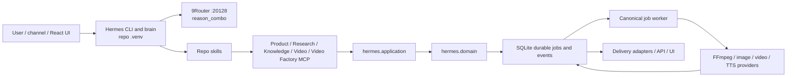

# Canonical Source Runtime

Status: implemented and verified on 2026-08-09.

## Decision

Hermes Personal has one executable source checkout:

`D:\work\hermes-agent`

The repo-local `.venv` is the only Python runtime used by canonical setup,
start, workers, and MCP servers. `%LOCALAPPDATA%\hermes` remains external
Hermes config/session state; it is not a source checkout. Business data is
stored under the sibling `hermes-agent-data` directory and never under source.

Generic reasoning sends only `reason_combo`. Provider selection and fallback
belong to 9Router. Specialized image, video, vision, STT, and TTS adapters do
not pass through the generic reasoning model.

## Runtime layout

| Concern | Canonical location |
|---|---|
| Source, CLI, skills, MCPs, application/domain, workers, providers, API/UI | `D:\work\hermes-agent` |
| Python executable | `D:\work\hermes-agent\.venv\Scripts\python.exe` |
| Hermes executable | `D:\work\hermes-agent\.venv\Scripts\hermes.exe` |
| Business DBs, workspaces, media, logs, backups | `D:\work\hermes-agent-data` |
| Hermes config, sessions, memory/state | `%LOCALAPPDATA%\hermes` |
| Generic model gateway | `http://127.0.0.1:20128/v1`, model `reason_combo` |

`setup.ps1` creates the repo-local environment, installs this checkout
editable, preserves `.env` secrets, creates the sibling data root, and
normalizes the five project MCP registrations with backups. `start.ps1`
preflights import origins, checks or starts local 9Router, starts the canonical
durable worker and backend, optionally starts React, then invokes the
repo-local `hermes.exe`.

## Capability ownership

| Capability | MCP module | Persistence / execution |
|---|---|---|
| Product | `mcp_servers.product.server` | `db\hermes.db`, application/domain lifecycle |
| Research | `mcp_servers.research.server` | `db\hermes.db`, durable research jobs |
| Knowledge | `mcp_servers.knowledge.server` | `db\hermes.db`, owner-scoped lifecycle |
| Video | `mcp_servers.video.server` | `db\video.sqlite`, canonical job worker |
| Video Factory | `mcp_servers.video_factory.server` | `db\video_factory.sqlite`, F1-F5 lifecycle |

MCP servers are thin capability boundaries. They call application/domain code;
they do not call each other.

## Classification

- `RESOLVED BLOCKER`: `start.ps1` previously failed because `param` was not
  the first executable statement.
- `RESOLVED ARCHITECTURE DRIFT`: MCP registrations pointed at temporary
  acceptance databases.
- `RESOLVED ARCHITECTURE DRIFT`: the text gateway selected app-owned model
  aliases and fallbacks instead of only `reason_combo`.
- `RESOLVED PORTABILITY GAP`: defaults pointed to `D:\HermesData`; defaults
  now derive the sibling data directory from the checkout location.
- `LEGACY BUT INACTIVE`: `scripts/install.ps1` is the upstream standalone
  installer and may clone into `%LOCALAPPDATA%`; canonical setup/start never
  call it.
- `LEGACY BUT INACTIVE`: root affiliate/migration/check scripts retain
  historical `D:\HermesData` defaults but have no production caller; canonical
  maintenance uses `scripts/hermes_maintenance.py`.
- `LEGACY BUT INACTIVE`: `%LOCALAPPDATA%\hermes\hermes-agent` may remain on
  this machine, but no canonical command or MCP registration loads it.
- `ACCEPTABLE EXTERNAL DEPENDENCY`: local 9Router, provider credentials,
  Google ADC, FFmpeg, and `%LOCALAPPDATA%\hermes` mutable agent state.
- `OPERATIONS GAP`: the current Python runtime links SQLite 3.50.4, which
  Hermes warns is affected by the WAL-reset bug. Upgrade the Python runtime to
  a build containing SQLite 3.51.3+ (or an applicable backport).

The legacy data root `D:\HermesData` is retained as a rollback copy. Its live
database was copied with SQLite online backup to
`D:\work\hermes-agent-data\db\hermes.db`; deletion is a separate housekeeping
decision after an observation period.
