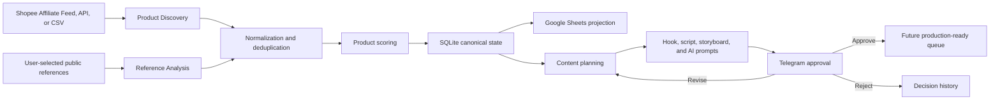

# Affiliate Product Research Pipeline Design

## Status

Approved in conversation on 2026-08-01.

## Goal

Extend Hermes Agent with an API-first research pipeline that discovers and
ranks technology accessories from the user's authorized Shopee Affiliate
sources, enriches selected products with public reference ideas, and produces
five to ten reviewable content packages per day.

The pipeline is for research and original content planning. It must not scrape
Shopee or TikTok at scale, download third-party videos without permission, or
copy another creator's script, footage, music, or identity.

## Initial Market

The first product niche is consumer technology and small smart electrical
devices:

- keyboards;
- mice;
- headphones and earphones;
- rechargeable mini fans;
- desk and smart lights;
- related desk, gaming, and workspace accessories.

The target audiences are office workers, gamers, and people who enjoy improving
their desk or workspace setup.

Price eligibility is:

- VND 200,000 to VND 500,000 for general products;
- up to VND 1,500,000 for keyboards.

## Scope

### Included

- Import 100 to 200 product candidates per daily run.
- Use authorized Shopee Affiliate Product Feed/API data when available.
- Accept user-provided CSV files and product URLs as a fallback.
- Accept user-selected public TikTok reference URLs and retrieve only metadata
  available through approved interfaces such as TikTok oEmbed.
- Normalize products and prevent duplicate records.
- Take daily metric snapshots to support sales-trend scoring.
- Rank products primarily by sales evidence and visual content potential.
- Select 15 to 25 products for deeper research.
- Generate five to ten original content packages per day.
- Synchronize operational views to Google Sheets.
- Send content packages to Telegram for approve, revise, or reject decisions.

### Excluded

- Automated crawling of Shopee search, category, product, or mobile endpoints.
- Automated crawling of TikTok Shop pages or competitor accounts.
- Downloading or re-editing third-party video or audio without documented
  permission.
- Buying products or submitting affiliate orders.
- Automatic video rendering, posting, scheduling, or account automation.
- TikTok Shop discovery through an unapproved API.
- CrewAI and MediaCrawler integration.

Automated asset generation, voice-over, video rendering, and publishing are a
separate future project. This design only prepares scripts, storyboards, and AI
asset prompts that such a project can consume.

## Source Policy

### Shopee

Shopee's Vietnam terms prohibit robots, spiders, and automated collection or
copying of Shopee content without prior written approval. Therefore, the
production source order is:

1. authorized Shopee Affiliate Product Feed;
2. approved Affiliate API if the user's account receives access;
3. user-exported CSV;
4. user-submitted product URL with manually supplied or authorized metadata.

Undocumented web or mobile endpoints are not a fallback.

### TikTok

Public visibility does not grant permission for automated collection or reuse.
Hermes may accept a public reference URL selected by the user and store oEmbed
metadata, the source URL, author attribution, caption, thumbnail, and analysis
notes. It must not treat oEmbed as permission to download or reuse the media.

TikTok Shop Affiliate Creator API may be added later after the application,
scope, and creator OAuth flow are approved. TikTok Research API is not a
commercial discovery source for Vietnam in this design.

### Rights Metadata

Every external source record includes:

- `source_url`;
- `source_type`;
- `collected_at`;
- `authorization_scope`;
- `rights_status`;
- `content_hash`.

Only assets marked as owned, licensed, affiliate-authorized for the intended
use, or generated by Hermes may enter a future production queue.

## Architecture



SQLite is canonical. Google Sheets is a projection for filtering, editing
allowed review fields, and viewing status. Sheet edits never directly replace
job state, source evidence, rights metadata, or decision history.

The existing Hermes job queue owns retries, leases, cancellation, and
idempotent execution. The existing LLM gateway owns provider routing and
fallback. The existing Telegram bot owns authorization and message delivery.

## Components

### Affiliate Source Adapters

All source adapters return the same normalized candidate contract and do not
write directly to Sheets:

- `ShopeeAffiliateFeedAdapter` reads an authorized Product Feed.
- `ShopeeAffiliateCsvAdapter` reads a user export and reports row-level
  validation failures.
- `ShopeeApprovedAffiliateApiAdapter` is enabled only when approved credentials
  and documented API access exist.
- `ManualProductAdapter` accepts explicit product data and URLs from the user.
- `TikTokPublicReferenceAdapter` accepts explicit public video URLs and
  retrieves approved metadata without bulk discovery or media download.

No source adapter stores account passwords, browser cookies, access tokens, or
service-account secrets in SQLite, Sheets, logs, or generated artifacts.

### Product Catalog Service

The catalog service:

- validates platform identifiers and source provenance;
- converts prices to integer VND;
- maps source categories to Hermes categories;
- applies niche and price eligibility;
- deduplicates by `(platform, external_product_id)`;
- uses a canonical URL hash only when a stable product ID is unavailable;
- records immutable source observations as daily snapshots;
- preserves the original source payload hash for audit.

Running the same import twice must update the existing product and snapshot
without creating duplicate logical records.

### Product Scoring Service

Eligible products receive an explainable score from 0 to 100:

| Signal | Weight |
| --- | ---: |
| Sales volume and observed sales growth | 45 |
| Visual demonstration potential | 30 |
| Price-range fit | 10 |
| Rating and shop confidence | 8 |
| Affiliate commission | 5 |
| Novelty against prior candidates | 2 |

Sales volume uses a log-scaled normalization within a comparable category so a
single extreme listing does not flatten the rest of the ranking. Sales growth
is used only after at least two dated snapshots exist. Until then, the score
uses current sales volume and lowers its confidence.

Visual potential is derived from explicit evidence:

- visible light, RGB, movement, or transformation;
- a clear before-and-after comparison;
- audible or tactile interaction;
- an obvious customer problem and visible resolution;
- multiple realistic use scenes;
- product imagery suitable for licensed compositing or AI backgrounds.

Each result stores component scores, `score_reason`, evidence references, and a
confidence level. Missing data lowers confidence; the LLM must not invent a
value to complete a score.

### Content Research Service

For each shortlisted product, the service creates a research brief containing:

- verified features and specifications with source references;
- customer problem and audience;
- strengths, limitations, and unverified claims;
- three to five original content angles;
- reference-pattern notes that abstract hook, pacing, and structure without
  copying expression or media.

Audience-specific framing is:

- office worker: convenience, desk space, comfort, and concentration;
- gamer: latency, interaction, sound, control, and performance;
- setup enthusiast: appearance, RGB, coordination, and space optimization.

### Content Package Service

The service ranks the generated angles and produces five to ten daily packages.
Each package contains:

- product and source identifiers;
- target audience;
- selected angle and rationale;
- original hook;
- a 30-to-90-second script;
- shot-by-shot storyboard and durations;
- product-image usage plan;
- prompts for AI backgrounds or supporting scenes;
- voice-over and text-overlay plan;
- verified claims and unresolved review warnings;
- rights status for every referenced asset.

The default script structure is hook, problem, demonstration, benefit,
limitation, and call to action. The script must not imply first-hand product use
when no real product was tested.

### Google Sheets Projection

The workbook contains:

1. `Products` for all imported candidates;
2. `Shortlist` for the 15 to 25 highest-ranked eligible products;
3. `Ideas` for generated angles and research briefs;
4. `Scripts` for content packages;
5. `Approval Queue` for Telegram and review state;
6. `Runs & Errors` for operational visibility.

Sync is checkpointed and resumable. A Sheets outage does not fail canonical
ingestion or content generation. On recovery, Hermes reconciles by stable IDs
and revision timestamps rather than appending duplicates.

Sheets credentials are supplied through environment configuration and are
never written to the workbook or repository. A disabled Sheets adapter and a
fake adapter are required for local and automated testing.

### Telegram Approval

Telegram messages show the product image, score and score reason, audience,
hook, script summary, storyboard summary, warnings, and stable package ID.

Authorized users can:

- approve a package;
- request revision with feedback;
- reject with a reason.

Every decision is idempotent and appended to decision history. Approval makes a
package eligible for a future production integration; it does not render or
publish a video in this project. Revision creates a new package revision and
keeps the previous revision for audit.

## Data Model

The feature adds the following logical records to the canonical SQLite store:

- `affiliate_products`;
- `affiliate_product_snapshots`;
- `affiliate_references`;
- `affiliate_content_ideas`;
- `affiliate_content_packages`;
- `affiliate_approval_events`;
- `affiliate_research_runs`.

Product identity is platform-scoped. Content ideas and packages are revisioned.
Snapshots and approval events are append-only. Product rows may update mutable
current values but retain creation and source provenance.

The minimum lifecycle is:

```text
candidate -> eligible -> shortlisted -> researched -> packaged
          -> pending_review -> approved | revision_requested | rejected
```

Invalid transitions return a domain error and do not partially update state.

## Daily Workflow

1. Start one research run with a stable idempotency key.
2. Import 100 to 200 authorized product candidates.
3. Validate, normalize, deduplicate, and snapshot current metrics.
4. Reject candidates outside the niche, price policy, or evidence threshold.
5. Score eligible products and select 15 to 25 for deeper research.
6. Analyze user-selected references and build original research briefs.
7. Generate and rank three to five angles per shortlisted product.
8. Produce five to ten content packages.
9. Commit canonical state before external delivery.
10. Sync the Google Sheets projection.
11. Send pending packages to Telegram and await explicit decisions.

## Error Handling

- Every job uses an idempotency key.
- Network and rate-limit failures use bounded exponential backoff with jitter.
- Permanent validation and authorization failures are not retried.
- A failing source adapter is isolated with a circuit breaker; other adapters
  and Hermes workflows remain available.
- Row-level import errors are recorded without discarding valid rows.
- LLM calls use the existing Hermes router and structured-output validation.
- A failed LLM result never overwrites a previously valid package revision.
- Telegram and Sheets delivery failures are retryable projections after the
  canonical transaction commits.
- Logs redact credentials and avoid full third-party payloads.
- No test contacts a paid LLM, live Google Sheet, live Telegram chat, Shopee, or
  TikTok.

## Quality And Safety Gates

A package cannot enter review when:

- a factual product claim has no source;
- price or sales data is stale without a visible warning;
- product identity is ambiguous;
- required rights metadata is missing;
- the script claims first-hand testing that did not occur;
- the content substantially duplicates a stored script or reference wording;
- an AI scene changes the product's physical design or asserted capability.

Generated packages clearly separate verified facts, creative framing, and
unverified items that require human review.

## Acceptance Criteria

- A fixture import containing 200 rows completes without duplicate logical
  products.
- General products outside VND 200,000 to VND 500,000 are ineligible.
- Keyboards above VND 1,500,000 are ineligible.
- Re-importing the same source is idempotent.
- Ranking component totals equal the published 100-point model.
- Every score includes evidence, reason, and confidence.
- Missing historical snapshots reduce confidence and do not fabricate growth.
- One run can select 15 to 25 shortlisted products and create five to ten
  content packages.
- Every package contains an original hook, a 30-to-90-second script,
  storyboard, AI-scene prompts, evidence, warnings, and rights metadata.
- Google Sheets reconciliation is stable by ID and survives a simulated outage.
- Telegram approve, revise, reject, duplicate callback, and unauthorized-user
  paths are covered by automated tests.
- SQLite remains canonical when Sheets or Telegram is unavailable.
- Automated tests make no paid-provider or live-platform calls.

## Delivery Sequence

### Milestone 1: Canonical Research Core

Add domain records, SQLite persistence, CSV/manual import, normalization,
deduplication, snapshots, eligibility, explainable scoring, and focused tests.

### Milestone 2: Research And Content Packages

Add reference metadata, research briefs, audience-specific angles, structured
content packages, LLM validation, and deterministic test doubles.

### Milestone 3: Review Projections

Add Google Sheets projection, Telegram decisions, delivery retries,
observability, and an end-to-end offline acceptance test.

Authorized Shopee Product Feed/API support can replace or supplement CSV input
through the same source adapter contract when the user's account exposes the
required access.

## References

- TikTok Shop developer guide:
  <https://partner.tiktokshop.com/docv2/page/tts-developer-guide>
- TikTok Shop Affiliate integration:
  <https://partner.tiktokshop.com/docv2/page/affiliate-integration>
- TikTok oEmbed documentation:
  <https://developers.tiktok.com/doc/embed-videos/>
- Shopee Vietnam terms of service:
  <https://help.shopee.vn/portal/4/article/77243>
- Local repository research:
  `docs/research/2026-08-01-crawl4ai-crewai-mediacrawler-fit.md`
- Shopee public-source research:
  `docs/research/2026-08-01-shopee-vietnam-public-affiliate-pipeline.md`
