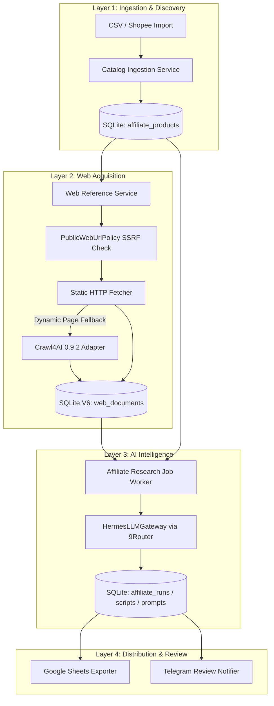

# Specification Design Document: Dedicated Affiliate Product Research & Crawl4AI Layered Pipeline

**Date:** 2026-08-02  
**Status:** PROPOSED  
**Target Repository:** `D:\work\hermes-agent`

---

## 1. Executive Summary & Goals

This specification details the architecture for an end-to-end, multi-stage **Affiliate Product Research & Video Script Generation Pipeline**. The system decouples raw product ingestion, web reference scraping via Crawl4AI, LLM intelligence, and distribution (Google Sheets & Telegram).

### Key Objectives:
1. **Decouple Raw Scraping from Processing:** Avoid direct anti-bot blocking by separating product metadata ingestion from web article crawling.
2. **Safe Crawl4AI Integration:** Use Crawl4AI 0.9.2 as a dynamic JS-rendering fallback adapter behind a bounded, SSRF-safe `WebDocumentFetcher` port.
3. **Structured AI Content Generation:** Leverage `HermesLLMGateway` (via 9Router proxy) to extract USPs, customer pain points, TikTok 3-act video scripts, and visual prompts (image & video generation prompts).
4. **Resilient Queue & Cache:** Cache scraped markdown in SQLite V6 (`web_documents`) by idempotency key, allowing jobs to resume without re-crawling or wasting LLM tokens.

---

## 2. Architecture & Data Flow



---

## 3. Component Details & Data Contracts

### 3.1 Layer 1: Ingestion Domain Model
```python
@dataclass(frozen=True)
class AffiliateProduct:
    product_id: str
    product_name: str
    category: str
    price: float
    sold_count: int
    rating: float
    commission_rate: float
    shop_name: str
    product_url: str
    image_url: str
    created_at: datetime
```

### 3.2 Layer 2: Web Document Acquisition & Crawl4AI Adapter
- **Crawl4AI Pinned Version:** `crawl4ai==0.9.2`
- **Security Constraints:**
  - SSRF Protection: Allow only public HTTP/HTTPS URLs; reject private/internal IP ranges, non-standard ports, and local network destinations.
  - Social/Marketplace Host Exclusions: Exclude direct raw dynamic crawling of hosts with heavy anti-bot protections (Shopee, TikTok, Douyin); use static API/CSV ingestion for those, and use Crawl4AI for web reviews/blogs.
  - Limits: Timeout = 30s per URL, Max HTML size = 2 MiB, Max Normalized Markdown = 200,000 characters.

### 3.3 Layer 3: AI Analysis & Script Output Schemas
The LLM outputs structured JSON matching the `AffiliateAnalysisOutput` schema:
```json
{
  "usp_list": ["USP 1", "USP 2"],
  "pain_points": ["Pain Point 1", "Pain Point 2"],
  "target_audience": "Audience description",
  "tiktok_script": {
    "hook": "0-3s Hook lines",
    "body": "3-20s Product demonstration & problem solving",
    "cta": "20-30s Call to action"
  },
  "visual_prompts": {
    "image_prompt": "Prompt for Flux/Midjourney",
    "video_prompt": "Prompt for Runway/Luma"
  }
}
```

### 3.4 Layer 4: Distribution & Review
- **Google Sheets Exporter:** Appends product rows, USP summaries, and TikTok script links to configured spreadsheet.
- **Telegram Review Notifier:** Sends an interactive message with buttons: `[Approve]`, `[Regenerate Script]`, `[Reject]`.

---

## 4. Error Handling & Recovery Strategies

1. **Scraping Failure / Anti-Bot Block:**
   - If Crawl4AI fails or is blocked on a web reference, fallback gracefully to metadata-only LLM prompting (using product name and category description).
2. **LLM Gateway Timeout / Error:**
   - Retry with exponential backoff (up to 3 retries). Reuse cached `web_documents` from SQLite so no re-crawling occurs.
3. **Database Migration Safety:**
   - Additive-only migrations targeting SQLite V6 schema.
