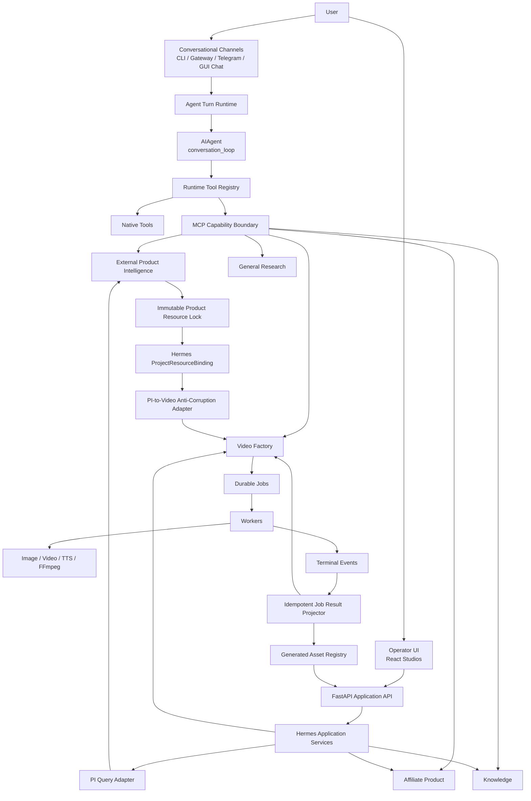

# Hermes General-Purpose Agent Platform Standardization Design

**Status:** Proposed

**Date:** 2026-08-12

**Scope:** `D:\work\hermes-agent` and the public MCP boundary of
`D:\work\Personal\Product-Intelligence`

## Purpose

Hermes is a general-purpose AI agent orchestrator. It owns conversational
reasoning, skill and tool selection, context, retries, and human interaction.
It does not absorb the internal business logic of every capability.

This design standardizes the existing system without replacing the canonical
agent loop or merging independently owned capability stores.

## Current-State Findings

The following facts are verified against the current source:

- `agent.conversation_loop.run_conversation` is the canonical conversational
  execution loop. `run_agent.AIAgent.run_conversation` is its compatibility
  facade.
- CLI, local gateway, and the API-server chat surface use `AIAgent`.
- The standalone `telegram_bot.py` free-text path and the GUI Assistant tab do
  not use `AIAgent`; they use direct routing or the deterministic
  `HermesAssistantRuntime` plan builder.
- `tools.registry.registry` is the runtime tool authority. External MCP tools
  are registered as `mcp__<server>__<tool>` by `tools.mcp_tool`.
- Five Hermes-owned MCP servers and external MCP servers share the same config
  and loader, but the loader does not model publisher, trust, principal mode,
  secret scope, or cost policy.
- The active Web backend is the `aiohttp` application in `web_studio.py`.
  `server/app.py` is a separate FastAPI composition root that is not started by
  `start.ps1` and still has unwired dependencies.
- Video Factory job completion is projected into domain state only after the
  browser polls and calls an apply endpoint. Closing the browser can therefore
  leave completed jobs unapplied.
- Product Intelligence is connected correctly as an external stdio MCP, but
  its public contract is get-by-ID oriented and is not sufficient for a
  searchable operator UI.
- Product Intelligence and Video Factory both define a type named
  `ResourcePack`, but the types represent different bounded contexts.

## Architectural Decisions

### 1. Hermes is the conversational orchestrator

`agent/conversation_loop.py` remains unchanged as the canonical loop unless a
separately proven runtime defect requires modification. Planning and skill
selection are model behaviors guided by prompts and schemas; they are not
represented as mandatory deterministic pipeline stages.

Interactive free-text channels converge on a channel-neutral Agent Turn
boundary above `AIAgent`. Deterministic UI actions and domain commands do not
need an agent turn.

### 2. Channels are adapters, not business owners

Conversational channels call the Agent Turn boundary. Operator interfaces call
read and command APIs directly. Channels own authentication, transport,
rendering, streaming, and local UI threading only.

```text
Conversational input -> Agent Turn Runtime -> tools/capabilities
Operator UI action   -> Application API    -> domain capability
```

### 3. Capabilities keep their bounded contexts

Hermes-owned application modules and external MCP servers retain independent
domain ownership. No MCP server imports another MCP server, and Hermes does not
import Product Intelligence packages.

The runtime catalog records capability metadata, but does not become a second
implementation registry or a second workflow engine.

### 4. Product Intelligence is resource intelligence, not orchestration

Product Intelligence owns:

- public source discovery and acquisition;
- evidence and provenance;
- canonical product, variant, and listing resolution;
- product media content-addressed storage, validation, and matching;
- immutable research snapshots;
- reviewable product resource-pack drafts and readiness decisions;
- immutable, versioned product resource locks;
- query and export projections of its canonical state.

Hermes owns the decision context and authorization that requests a lock, but
Product Intelligence validates and persists the immutable research lock. This
keeps the lock beside the evidence it attests to without turning Product
Intelligence into a campaign or production workflow engine.

For the initial single-admin deployment, Product Intelligence research and
media are an admin-global catalog. Catalog browsing uses an explicitly
admin-authorized PI route, while use inside Video Factory requires an
owner/project-scoped `ProjectResourceBinding`. A future multi-tenant PI service
must add tenant identity to its public contract before tenant data is admitted.

Hermes stores only a binding:

```python
@dataclass(frozen=True)
class ProjectResourceBinding:
    project_id: str
    source_system: str
    resource_pack_id: str
    lock_version: int
    manifest_digest: str
    canonical_product_id: str
    variant_id: str | None
```

Replacing a binding does not mutate or unlock Product Intelligence state.

### 5. Affiliate Product remains a separate business capability

Affiliate Product owns authorized feed ingestion, commission, opportunity
scoring, shortlist, campaign content, and affiliate review. It may reference a
Product Intelligence snapshot or canonical product, but it must not recreate
Product Intelligence evidence, media, or identity as a second source of truth.

### 6. Video Factory consumes a production resource binding

The Product Intelligence resource lock and the existing Video Factory
`ResourcePack` are not the same type. A Hermes anti-corruption adapter verifies
the Product Intelligence lock, then produces a Video Factory input draft.

Video Factory continues to own creative context, character references, brief,
scene plan, storyboard, generated scenes, timeline, and export.

### 7. Workers are below capabilities

Workers are not peers of tools or MCP servers. A tool or API invokes an
application service; the service submits durable work; a worker performs the
bounded operation and emits a terminal event.

```text
Agent/API -> capability -> application service -> job -> worker -> provider
                                                     |
                                                     v
                                             terminal event
                                                     |
                                                     v
                                           idempotent projector
```

The browser never owns the job-to-domain projection transaction.

### 8. FastAPI becomes the canonical operator API

`server/app.py` becomes the single Web composition root. React uses same-origin
relative `/api` URLs. `web_studio.py` and `video_factory_api.py` remain
compatibility adapters only until endpoint and UI parity is verified.

The cutover is a strangler migration. No legacy data is deleted during the
standardization program.

## Target Architecture



## Canonical Contracts

### CapabilityDescriptor

Every model-visible capability resolves to one descriptor:

```python
@dataclass(frozen=True)
class CapabilityDescriptor:
    capability_id: str
    wire_name: str
    owner: str
    source: Literal["native", "hermes_mcp", "external_mcp", "generated"]
    trust: Literal["first_party", "configured_external", "untrusted"]
    version: str
    toolset: str
    side_effects: Literal["read", "write", "external", "paid"]
    principal_mode: Literal["session", "server", "none"]
    idempotency: Literal["required", "supported", "none"]
    approval_policy: str
    data_classification: str
```

This descriptor is metadata over the existing runtime registry. It does not
replace `tools.registry.registry`.

### PrincipalContext

`owner_user_id` is not accepted as an untrusted model-selected identity for
Hermes-owned capabilities. The authenticated channel/session binds principal
context before domain dispatch.

```python
@dataclass(frozen=True)
class PrincipalContext:
    actor_id: str
    owner_user_id: str
    platform: str
    session_id: str
    roles: tuple[str, ...]
```

### ProductResourceLockReference

The cross-repository contract contains no absolute local filesystem path:

```python
class ProductResourceLockReference(TypedDict):
    resource_pack_id: str
    version: int
    snapshot_id: str
    canonical_product_id: str
    variant_id: str | None
    manifest_digest: str
    digest_algorithm: Literal["sha256"]
    digest_schema_version: str
    canonical_manifest: dict[str, object]
    status: Literal["locked"]
    media: list[dict[str, object]]
    restrictions: dict[str, object]
    provenance: dict[str, object]
    schema_version: str
```

Media uses opaque asset IDs and MCP resource URIs. The browser never receives
Product Intelligence host paths. `manifest_digest` is SHA-256 over UTF-8
canonical JSON for `canonical_manifest`: object keys sorted recursively, no
insignificant whitespace, arrays order-preserving, and numbers encoded by the
declared digest schema. The adapter rejects unknown digest schema versions.

Creating a lock also carries an approval attestation with principal ID, role,
approval reference, audit timestamp, and idempotency key. Product Intelligence
authorizes and persists that attestation with the immutable lock; a bare draft
revision is insufficient authorization.

```python
@dataclass(frozen=True)
class ProductResourceLockCommand:
    draft_id: str
    expected_revision: int
    principal_id: str
    principal_role: str
    approval_reference: str
    occurred_at: str
    idempotency_key: str
```

### ApprovalCommand

Approvals are auditable domain commands rather than anonymous boolean flips:

```python
@dataclass(frozen=True)
class ApprovalCommand:
    project_id: str
    artifact_type: str
    artifact_version: int
    decision: str
    actor_id: str
    actor_role: str
    notes: str
    idempotency_key: str
    occurred_at: str
```

### GeneratedAsset

Generated media has stable identity independent of filenames:

```python
@dataclass(frozen=True)
class GeneratedAsset:
    asset_id: str
    owner_user_id: str
    project_id: str
    job_id: str
    artifact_type: str
    artifact_id: str
    artifact_version: int
    storage_key: str
    mime_type: str
    checksum_sha256: str
```

## Security Invariants

- External MCP subprocesses receive only safe baseline variables and secrets
  explicitly allowlisted for that server. Environment interpolation may only
  reference names in that same allowlist.
- Authenticated principal identity is injected by the runtime; the model cannot
  impersonate another owner by supplying an argument.
- Skills reference canonical tool names and declare allowed tools.
- Eager, lazy, and refresh MCP discovery use identical collision and ownership
  rules and fail closed.
- Web defaults to loopback binding. Remote exposure requires explicit config and
  authentication.
- Upload and media endpoints resolve opaque asset IDs, verify project ownership,
  enforce path containment, reject traversal and symlink escape, and use a MIME
  allowlist.
- Paid provider work requires a recorded authorization reference before enqueue.
- Automated verification clears live provider credentials, forces fake provider
  factories, and fails closed on attempted provider network/auth calls.
- Workers do not contain semantic routing, user conversation, or approval logic.

## Data Ownership

| Data | Canonical owner |
| --- | --- |
| Agent sessions and conversational memory | Hermes Agent runtime |
| Product evidence, identity, listing and product media | Product Intelligence |
| Product resource draft/readiness/immutable lock | Product Intelligence |
| Project binding to a product resource lock | Hermes application layer |
| Affiliate commission, score, shortlist and content package | Affiliate Product |
| Knowledge proposals and approved knowledge | Hermes Knowledge |
| Creative brief through final export | Video Factory |
| Job state, lease, attempts and terminal event | Hermes durable job plane |
| Generated media metadata | Hermes generated asset registry |
| Physical Product Intelligence media | Product Intelligence data root |
| Physical Video Factory media | Video Factory workspace |

Separate SQLite databases per bounded context are acceptable. Standardization
does not mean merging databases.

## Compatibility and Retirement Policy

Every legacy path is classified as `CANONICAL`, `COMPATIBILITY`,
`MIGRATE_NEXT`, or `RETIRED`. A component is removed only when:

1. all production callers use the replacement;
2. state parity and rollback are verified;
3. focused and end-to-end tests pass;
4. the runbook names the replacement entry point;
5. one observation window completes without fallback use.

ADR-001 is historical and is superseded where it conflicts with ADR-007,
ADR-009, and this design. It must not be used as a current runtime authority.

## Delivery Order

1. Freeze architecture contracts and inventories.
2. Close critical MCP and Web security gaps.
3. Repair Video Factory MCP loading and durable job completion projection.
4. Publish Product Intelligence query/draft/lock contracts.
5. Add Hermes resource binding and PI-to-Video adapter.
6. Cut the operator API over to FastAPI and secure asset serving.
7. Build the unified Product Research and Media Studio read experience.
8. Converge standalone Telegram and GUI free-text paths on the Agent Turn
   boundary.
9. Retire compatibility paths only after parity and observation.

## Out of Scope

- Rewriting `agent/conversation_loop.py`.
- Importing Product Intelligence Python packages into Hermes.
- Merging Product Intelligence, Hermes, and Video Factory databases.
- Replacing affiliate scoring with Product Intelligence.
- Routing search/filter/gallery interactions through an LLM.
- Calling paid image, video, or TTS providers during automated tests.
- Deleting legacy runtime data during the migration.
