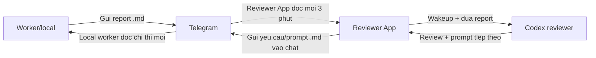

# Reviewer App

Reviewer App la ung dung wakeup/review bridge cho vong lap Telegram -> Codex review -> Telegram -> local worker.
App nay khong phai worker thuc thi code va cung khong tu y sua project. Nhiem vu cua no la doc report do worker/local gui len Telegram, wakeup Codex reviewer, ghi lai review ky thuat, roi gui mo ta yeu cau hoac prompt tiep theo vao chat Telegram de worker local tiep tuc xu ly.

## Muc tieu

- Lang nghe Telegram de tim report moi tu local worker hoac user.
- Tai file report dinh kem ve thu muc inbox cua Reviewer App.
- Doc noi dung report dang `.md`, `.txt`, `.json`, `.log` hoac text message.
- Tao file wakeup prompt `.md` chua report va yeu cau Codex review theo vai tro reviewer/kien truc su project.
- Prompt yeu cau Codex tao review bang tieng Anh de tranh loi mojibake/encoding tren Telegram.
- Gui file wakeup prompt `.md` vao chat Telegram bang `TELEGRAM_BOT_TOKEN` va `TELEGRAM_REVIEW_CHAT_ID`.
- Tu dung sau 5 gio de tranh chay nen qua lau.

## Cau truc chinh

```text
C:\Work\Code\Upgrade_chat_bot
|-- .env
|-- Reviewer_app
|   |-- reviewer_app.py
|   |-- README.md
|   |-- reviewer_app.py.bak
|   `-- reports
|       |-- telegram_inbox
|       |-- reviews
|       `-- reviewer_state.json
```

- `reviewer_app.py`: entrypoint cua watcher reviewer.
- `reports\telegram_inbox`: noi luu report tai tu Telegram.
- `reports\reviews`: noi luu file wakeup prompt gui cho Codex reviewer.
- `reports\reviewer_state.json`: state da xu ly de han che lap lai message cu.
- `.env`: file cau hinh duoc uu tien doc tu `C:\Work\Code\Upgrade_chat_bot\.env`.
- `reviewer_app.py.bak`: ban backup truoc khi tich hop watcher moi.

## Bien moi truong

Dat trong `C:\Work\Code\Upgrade_chat_bot\.env`:

```env
TELEGRAM_BOT_TOKEN=...
TELEGRAM_REVIEW_CHAT_ID=...
REVIEWER_IDLE_NO_REPORT_SCANS=3
REVIEWER_IDLE_AUDIT_TARGET=C:\Work\Code\Hermes_download\hermes-agent
```

Bat buoc:

- `TELEGRAM_BOT_TOKEN`
- `TELEGRAM_REVIEW_CHAT_ID`

Reviewer App chi dung Telegram Bot API, nen khong can `TELEGRAM_API_ID`, `TELEGRAM_API_HASH`, userbot hay Telethon session.

Tuy chon:

- `REVIEWER_IDLE_NO_REPORT_SCANS`: so lan scan lien tiep khong co report hop le truoc khi gui idle audit wakeup cho Codex. Mac dinh la `3`. Dat `0` de tat idle audit. Bien cu `REVIEWER_IDLE_NO_MESSAGE_SCANS` van duoc ho tro neu da cau hinh truoc do.
- `REVIEWER_IDLE_AUDIT_TARGET`: source/repo/folder Codex nen review khi idle audit. Mac dinh la `C:\Work\Code\Hermes_download\hermes-agent`. `Upgrade_chat_bot` chi la noi dat reviewer bridge, khong phai source chinh can nang cap.

## Workflow

1. Worker/local tao report sau khi doc file, sua code, build/test hoac phan tich he thong.
2. Worker/local gui report len Telegram bang text hoac file `.md`.
3. Reviewer App poll Telegram moi 3 phut de tim message/report moi.
4. Neu message co file report, app tai file ve `reports\telegram_inbox`.
5. App loc report hop le, bo qua review cu hoac message khong lien quan de tranh tu review chinh minh.
6. App tao file wakeup prompt cho Codex/reviewer flow.
7. File wakeup prompt chua report, context, va yeu cau Codex tao review/prompt bang tieng Anh cho worker.
8. App gui file wakeup prompt `.md` vao chat Telegram bang bot token va chat id da cau hinh.
9. Neu 3 lan scan lien tiep khong co report hop le, app gui `codex_idle_audit...md` de yeu cau Codex phan tich source va tao huong fix/upgrade cho worker.
10. Sau khi da gui idle audit, app dat `idle_audit_pending=true` va khong gui lai idle audit khac cho den khi co worker report hop le moi.
11. App cap nhat `reviewer_state.json` de khong xu ly lap lai message da review va de dem so lan idle.
12. App tiep tuc vong lap cho den khi dat thoi gian gioi han 5 gio.

## Cach chay

```powershell
cd C:\Work\Code\Upgrade_chat_bot\Reviewer_app
python reviewer_app.py
```

Kiem tra cu phap nhanh:

```powershell
python -m py_compile reviewer_app.py
```

## Hanh vi an toan

- Reviewer App chi doc report, wakeup Codex reviewer va tao review/prompt, khong tu sua code project dich.
- Reviewer App khong tu chay build/test cua repo dich.
- Reviewer App khong tu phan tich source code; khi idle qua nguong, no chi gui prompt danh thuc Codex de Codex phan tich.
- Reviewer App khong spam idle audit: neu da co audit pending va worker chua reply report moi, app se khong gui audit lap lai.
- Bot chi gui review ve chat id duoc cau hinh trong `TELEGRAM_REVIEW_CHAT_ID`.
- State file giup tranh spam Telegram bang viec reply lai cac message da xu ly.
- Gioi han 5 gio giup watcher khong chay vo han ngoai y muon.

## Xu ly loi thuong gap

### Khong thay report moi

- Kiem tra worker/local da gui report vao dung Telegram chat chua.
- Kiem tra `TELEGRAM_REVIEW_SOURCE_CHAT`.
- Kiem tra `reports\reviewer_state.json`; message qua cu co the da duoc baseline/mark processed.

### Khong gui duoc review len Telegram

- Kiem tra `TELEGRAM_BOT_TOKEN`.
- Kiem tra `TELEGRAM_REVIEW_CHAT_ID`.
- Dam bao bot co quyen gui message/file vao chat do.

### Khong doc duoc Telegram bang bot

- Kiem tra `TELEGRAM_BOT_TOKEN` va `TELEGRAM_REVIEW_CHAT_ID`.
- Dam bao bot nam trong dung chat va co quyen doc message/file.
- Neu bot dang dung webhook, `getUpdates` co the bi Telegram tu choi; can tat webhook truoc khi chay polling.

### Codex khong nhan duoc wakeup prompt

- Kiem tra Reviewer App da gui file `codex_wakeup...md` vao dung chat Telegram chua.
- Kiem tra Codex/useAI dang lang nghe dung chat do chua.
- Kiem tra noi dung report khong bi rong hoac bi loc nham la message khong lien quan.

## Vai tro trong he thong

Reviewer App la lop wakeup Codex reviewer va dieu phoi yeu cau tiep theo. Worker/local van la ben thuc thi code. Telegram la kenh trao doi file report, review va prompt moi.


